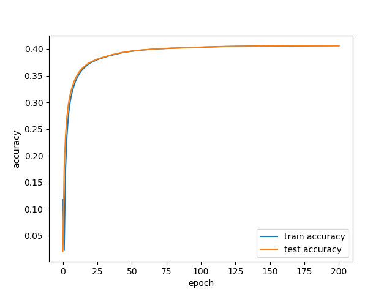
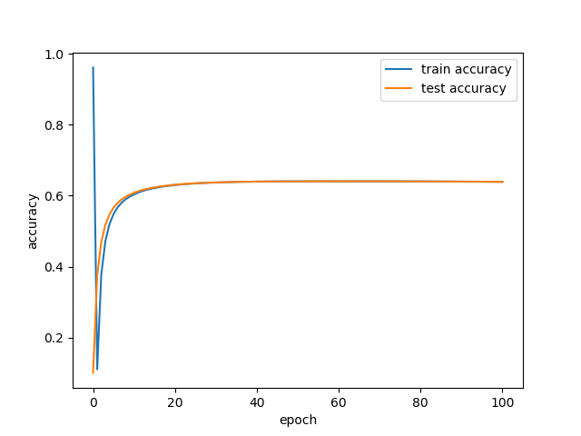
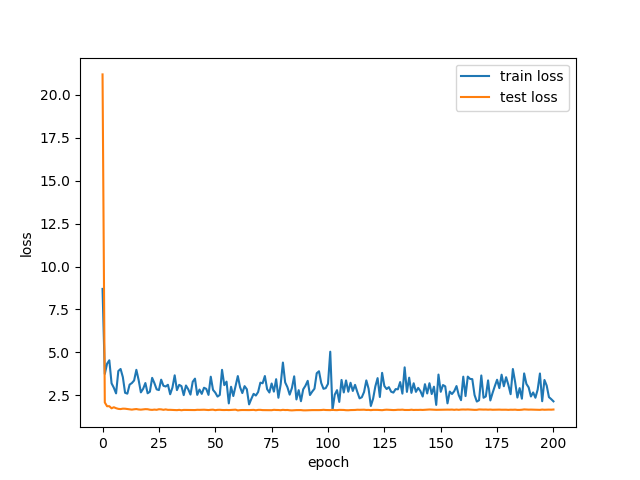
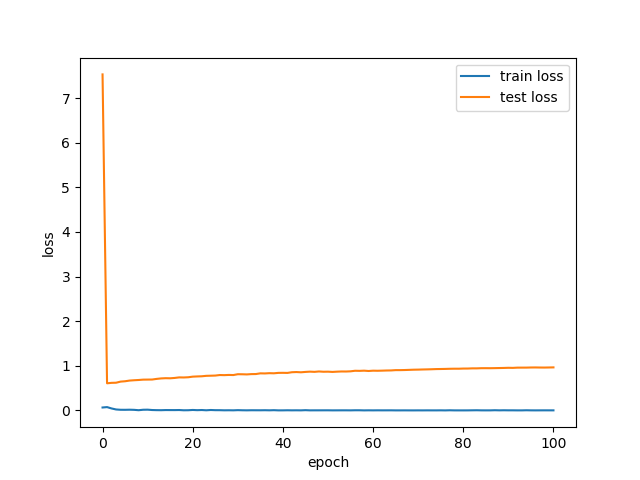

# DeViSE
In this project we reproduction **Deep Visual-Semantic Embedding Model** in Cifar-100 

## Dataset for visual model pre-training
- Cifar 100 

## NETWORK STRUCTURE
### visual_embedding
   resnet(56 layers residual layers)
### text_embedding
   word2vec

## Result
<table>
  <tr>
    <th>Model Type</th>
    <th>visual branch</th>
    <th>text branch</th>
    <th>dim</th>
    <th>acc@1</th>
  </tr>
  <tr>
    <td>Softmax baseline</td>
    <td>resnet</td>
    <td>--</td>
    <td>--</td>
    <td>0.6806</td>
  </tr>
  <tr>
    <td rowspan="2">DeViSE</td>
    <td rowspan="2">resnet</td>
    <td>GoogleNews-vectors-negative300</td>
    <td>300</td>
    <td>0.4064261</td>
  </tr>
  <tr>
    <td>freebase-vectors-skipgram1000-en.bin</td>
    <td>1000</td>
    <td>0.6406754</td>
  </tr>
</table>

## Experiment
| Type     | dim=300                         | dim=1000                          |
| -------- | ------------------------------- | --------------------------------- |
| accuracy |   |   |
| loss     |  |  |
